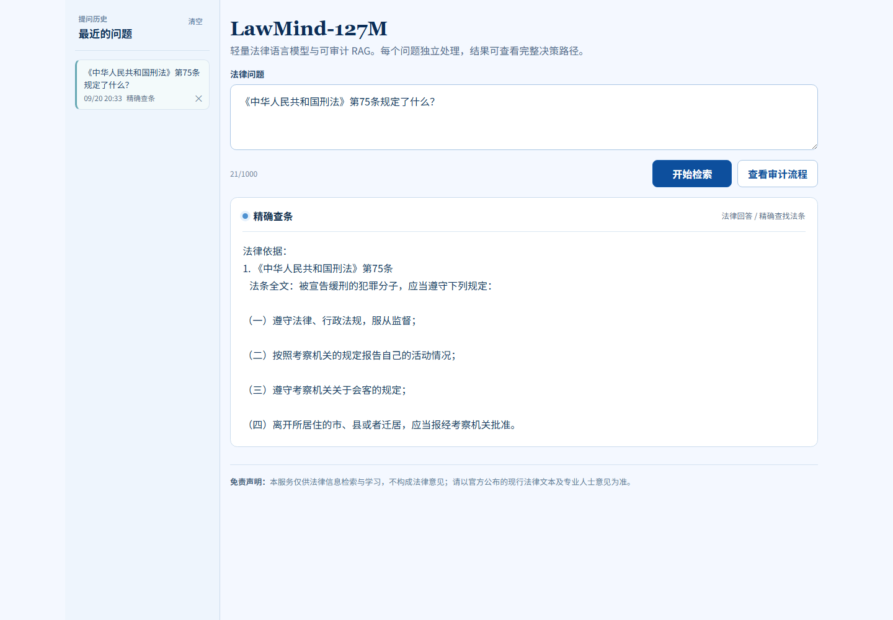
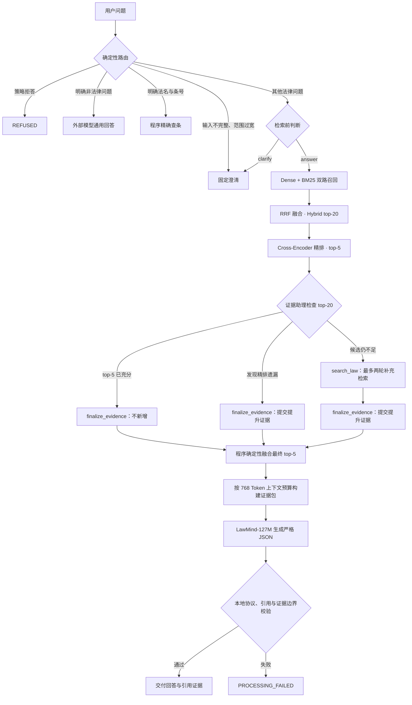
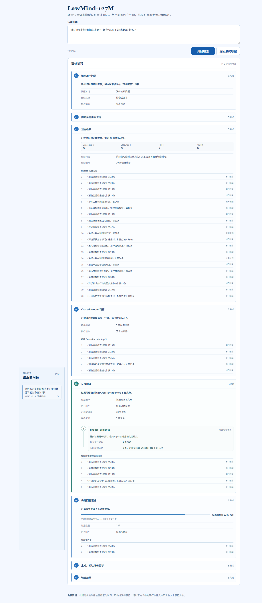

# LawMind-127M

基于 [MiniMind](https://github.com/jingyaogong/minimind) 训练的轻量中文法律语言模型与可审计 Agentic RAG 展示项目。

项目从 64M MiniMind 出发，完成 Tokenizer 扩展、通用预训练、法律持续训练（CPT）、法律 SFT 与 RAG-SFT，并将 127M 参数模型接入覆盖法律法规和部门规章的检索增强生成链路。系统以确定性程序约束路由、证据边界、输出协议和失败行为，同时保留每次回答的完整执行轨迹。



## 项目亮点

| 能力 | 当前实现 |
| --- | --- |
| 轻量法律模型 | 词表由 6,400 扩展至 12,000，网络由 8 层扩展至 16 层，得到 127M 参数模型。 |
| 法律知识库 | 当前合并索引包含 110,469 条法律法规与部门规章条款，支持语义检索和法名、条号精确查找。 |
| 混合检索 | `Dense top-k 30` 与 `BM25 top-k 30` 双路召回，经 `RRF` 融合形成 Hybrid top-20，再由 `Cross-Encoder` 精排。 |
| Agentic 证据选择 | 证据助理检查完整 top-20，通过 `finalize_evidence` 提升遗漏证据；候选不足时可用 `search_law` 补充检索，最多两轮。 |
| 可审计问答 | 前端展示问题分类、澄清判断、检索参数、工具调用、候选法条、证据预算、本地校验和最终状态。 |
| 明确失败边界 | 外部模型、检索、证据构包、生成或协议校验失败时返回 `PROCESSING_FAILED`，不使用未经校验的回答降级。 |

## 回答流程

系统先通过确定性规则划分明显分支。只有需要语义检索的法律问题才进入混合检索、证据助理和 MiniMind 生成链路；外部模型不执行生成后的答案审查。



精确查条由程序直接返回完整法条；澄清和拒答不会进入检索及生成。语义检索链路中，`search_law` 只补充候选，`finalize_evidence` 只提交证据提升建议，最终 top-5 始终由程序确定性融合。

## 可审计前端

前端使用 React + TypeScript 构建，并由 FastAPI 同源提供页面与 API。用户先看到最终答案；切换到审计流程后，可以核对本次请求实际经过的节点和每一步使用的数据。

- 提问历史保留对应答案、检索信息和审计轨迹；
- 混合检索展示 Dense、BM25、RRF 参数及 Hybrid top-20；
- 精排节点展示 Cross-Encoder top-5；
- 证据助理按调用顺序展示多轮 `search_law` 与 `finalize_evidence` 的参数、追问和新增证据；
- 证据构包展示最终法条以及“证据包预算 / 模型上下文长度”；
- 澄清或失败时保留模型原始输出，成功的检索回答可单独展开法律依据。

下面是一次真实 `ANSWER / RETRIEVAL` 请求的审计页面：

<p align="center">
  
</p>

## 模型与程序职责

| 组件 | 职责 |
| --- | --- |
| LawMind-127M | 只根据最终证据包生成法律回答，并输出包含 `summary` 与 `citations` 的严格 JSON。 |
| 外部模型 | 执行检索前澄清判断、证据助理工具调用和非法律问题的通用回答。 |
| 确定性程序 | 负责问题路由、精确查条、混合检索、精排、证据融合与构包、协议校验、引用映射、结果渲染和异常边界。 |

法条身份、证据范围、输出格式与失败处理均由程序约束，避免把系统可靠性完全交给模型自由生成。

## 核心结果

| 阶段 | 结果 |
| --- | --- |
| 通用预训练 | 清洗 443 万条通用语料，完成 `4.8B tokens × 2 epochs`；最终 Loss `2.51`，PPL `12.42`。 |
| 法律持续训练 | 基于 154.6 万份法律数据完成 `2.4B tokens` CPT；法律 Loss 下降 `47.12%`。 |
| RAG-SFT | 最终选择 Clean:HN=`2:1`、上下文长度 `768`、`2 epochs`、父权重 `cpt_250m`。 |
| 生成评估 | 协议率 `94.94%`、Required Recall `82.91%`、Exact-set `55.70%`。 |
| 检索评估 | 100 条法律留出集上，Top-20 完整法条覆盖率 `96.67%`、Top-5 精排覆盖率 `91.67%`、MRR@5 `0.9139`。 |

### 训练闭环

```text
12,000 ByteLevel BPE Tokenizer
  -> 通用预训练
  -> 法律 CPT
  -> 法律 SFT
  -> RAG-SFT 对照实验与模型选择
  -> 可审计 Agentic RAG
```

原始 64M MiniMind 在 RAG 场景中存在法条遗漏。项目扩展词表与网络层数后，使用高占比法律数据训练 Tokenizer 和模型；法律 CPT 阶段保留 5 个父权重，再通过数据配比、上下文长度、训练轮数和父权重对照实验选出最终 RAG-SFT 模型。

### 长法条窗口策略

针对 BGE-small 与 BGE-reranker 的输入预算限制，检索模块采用 `512 tokens` 滑动窗口和 `64 tokens` 重叠：以最高窗口得分参与排序，再由完整法条进入回答链路。该策略使证据包完整命中率由 `72.86%` 提升至 `78.33%`。

## 项目结构

```text
LawMind-127M/
├── minimind/                 # 模型、训练、数据处理与推理
│   ├── model/                # 模型定义、LoRA 与 Tokenizer 配置
│   ├── trainer/              # 预训练、CPT、SFT、RAG-SFT 与评估
│   ├── dataset/              # 数据准备、校验与构造脚本
│   └── scripts/              # 训练、服务、转换与评估入口
├── rag/                      # 法律 RAG 系统
│   ├── answering/            # 证据构包、回答协议与结果渲染
│   ├── chunk/                # 法条结构化切分与索引构建
│   ├── core/                 # 统一结果契约与 RAG 总编排
│   ├── knowledge/            # 只读法条仓库与精确查条
│   ├── query/                # 查询路由、检索前判断与 Agentic 证据检查
│   ├── retrieval/            # Dense、BM25、RRF 与重排
│   └── app/                  # 运行时组装入口
├── api/                      # FastAPI 服务入口
├── frontend/                 # React + TypeScript 展示页
├── docs/                     # 跨模块设计与研究资料
└── scripts/                  # 项目级辅助脚本
```

## 仓库边界

本仓库发布源码、训练脚本、服务入口和评估逻辑，不提交原始数据集与大型生成物。法律原文与法条索引、模型权重、检查点、训练日志、向量索引及本地缓存由 `.gitignore` 排除。

## 致谢与来源

- 模型训练基础来自 [MiniMind](https://github.com/jingyaogong/minimind)。引用、修改和再发布相关代码时，应继续遵守上游仓库的许可证要求。
- 法律知识库的原始文本与数据处理产物不随本仓库发布；使用者应自行确认数据来源、版本、授权和适用范围。

> 本项目仅用于法律信息检索、模型训练与工程研究，不构成法律意见。
